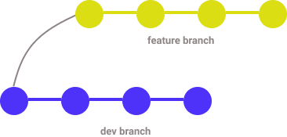
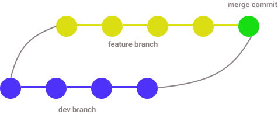
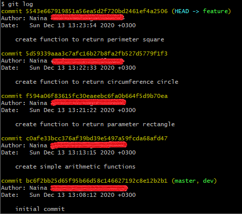
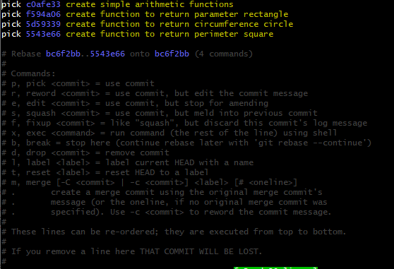
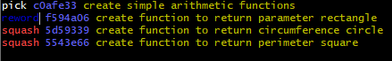

When we are just starting out with Git, we usually first learn git commands like `add`, `commit`, `pull`, and `push`. Then as we gain more confidence, we learn `git rebase`. This is because git rebase can be intimidating, even for experienced developers. But once you get to know the rules, I think it will be less daunting to use. It is a powerful tool that we can take advantage of to create a beautiful commit history. Let us see in this post what is git rebase and how we can take advantage of this powerful feature.

## git rebase vs git merge

Git rebase is often considered as an alternative to git merge. When we rebase, we are applying commits of one branch on top of the commits of another branch.

It is best understood with an example. Let us say you are developing a new feature for some app, so you `checkout -b feature` branch from `dev` branch. You work on your stuff and add your commits. Meanwhile, other developers have also worked on their stuff, and now you want to bring their changes into your branch. To do that, you could either do a merge or a rebase.

Here is how our branch might look like after working on a feature branch.



When we merge `dev` to `feature` branch , here is what happens.



A new merge commit is added into our commit history.

On the other hand, when we `rebase`, here is what happens.


Our new commits in the feature branch are being added at the end of the commits of the dev branch, resulting in a linear commit history.

For the example above, the line of command to rebase would be like this.

```bash
git rebase dev feature
```

But it is more common to first checkout to the branch, and then rebase from there.

```bash
git checkout feature
git rebase dev
```

## When to rebase

We have already seen one use case of rebase. When we want to update our branch with changes made by other developers in other branches, we could use rebase. For example, if Sally made some changes in the `dev` branch, Bob can rebase his branch to get those changes into his branch.

Another use case of rebase is when updating your branch prior to merging into the main branch. We update our branch with the latest branch by rebasing, and then merge. This process is usually done through a Pull Request.

When rebasing, you may encounter a conflict. Because rebase goes through each commit, git will immediately notify where the conflict is. You resolve the conflict found in each commit. Once the conflict is resolved, run `git add` to add the changes, and then continue the rebasing process with `git rebase --continue`.

## Golden rule of rebasing

The golden rule of rebase is that you should **NOT** use rebase on a public branch that is shared with other developers. Because rebase rewrites history, it will make other developers' branch out of sync. It could be catastrophic. So only use rebase in **private** branches that you are working on.

## Interactive rebase

Interactive rebase is what makes rebase feature really powerful. With interactive rebase, you can reorder, edit, delete, or combine commit messages together. You have complete control on how you want your commit history to look like.

To run rebase in interactive mode, pass the `-i` flag with the command (i.e `git rebase -i feature dev`).

Let us say our `git log` in feature branch looks like this.



The commits are ordered from the latest to the oldest. When we run interactive rebase (`git rebase -i dev`), we will get the following screen.



The commits are now shown in reverse order, meaning the oldest commits come first. Each commit has a `pick` command followed by the hash of the commit. By picking, you are saying that you want to include this commit. There are other commands in the list that you can use beside `pick`.

If you wanna change the commit message for example, you can use `reword`. If you wanna combine multiple commits into a single commit, you can use `squash`. If you wanna reorder, you simply move the commits into the desired order.



## Conclusion

I hope you have somehow understood what rebase does and how to use it. Here are some key points to remember from this post.

1. When you rebase, your new commits are added after the last commit of the branch you are rebasing from, thus creating a linear history.
2. Rebasing does not create an extra commit.
3. You should **NOT** rebase a public branch.
4. You can reorder, edit, delete, or merge commit messages with interactive rebase.

Practice is the only best way to truly validate what you learn, so I encourage you to initialize a git repo and play around with the rebase command. It's ok if you break things 😉
