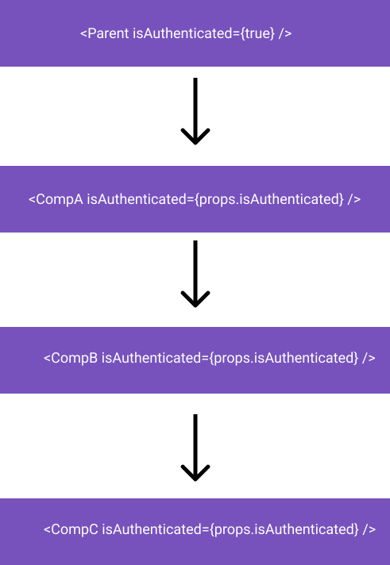
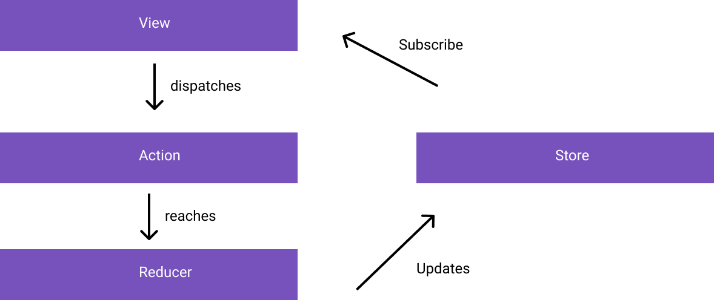

In this post, I will show you how to create a global state management without using a third party library like Redux.

## Why do we need a global state management tool

In your app you will often need some sort of global data that different components need to access. For example, a component might need to know whether a user is authenticated or not.

Without using a state management tool, in React you could pass down isAuthenticated data from the parent component to child component through props. This might not be a problem if there is only one component in between the top-level and child component. However, as the level of nesting increases, it becomes a problem passing props from the top level component to the nth-child component. This problem is known as `prop drilling`.



In order to solve this problem, we need a global state where all components can access the state no matter where they are in the tree level.

A global state management tool like Redux provides us with a global state.

## Redux

The concept of how Redux works is simple. There is a central store that holds the state of the application. The view subscribes to the store for state changes.

To update the state in the store, the view needs to dispatch an action. Actions are simply like events, and they have a type property which indicates what type of event is dispatched.

An action then reaches the reducer. A reducer is a pure JavaScript function that takes the current state, perform an action to change the state, and return the new state. Reducers are responsible for updating the store.

When the store changes, the view receives those changes and updates its state accordingly.

Here is a simple visual diagram for the explanation above.



So how can we create our own global state without using Redux?

## React Context API

Before React hooks, Redux was the go-to solution of developers manage global state. Redux, however, comes with its own complexities and challenges. Depending on what you wanted to achieve, using Redux can be overkill.

We can now create our own global state just using React Context API.

According to the docs,

> Context provides a way to pass data through the component tree without having to pass props down manually at every level.

We can share global data such as current user, preferred language, or theme without having to pass down props along the React component tree.

To use context, we simply have to create a context object.

```jsx
const myContext = React.createContext(value);
```

`createContext` returns a **context provider component** that allows consuming component to subscribe to changes. It accepts a value props that will be made available to child components.

```jsx
<myContext.Provider value={true}>{children}</myContext.Provider>
```

Any children component of the myContext will be able to access the value provided.

We can use the `useContext(context)` hook to access the value. The argument to `useContext` is the context object we created.

```jsx
const value = useContext(myContext);
```

Before I give a real example of how to use context, I want to briefly discuss about the `useReducer` hook as we are also going to use it in creating our global store.

## useReducer

`useReducer` is an alternative hook to `useState` to manage state. If you have used Redux before, then you would already know how `useReducer` works.

```jsx
const [state, dispatch] = useReducer(reducer, initialArg, init);
```

The first argument is a callback function that receives the state and action as arguments and returns the new state. `(state, action) => newState`

The second argument is the initial state.

If you want set the initial state lazily, you can pass an `init` function as a third argument to `useReducer`.

`useReducer` returns the state and a dispatch function as an array that we can destructure.

### useState vs useReducer

Both hooks perform the same function in a sense that they both allow us to store state in our app. So how do you know which one to use?

The [React docs](https://reactjs.org/docs/hooks-reference.html#usereducer) somehow gives us a general guideline. If you have complex state logic or your next state depends on the previous value, you can you use useReducer.

## Real Example

So far I have just been showing the syntax for these hooks, but let me now give a real example of how to actually use them.

In this example, we are going to create a simple contact book that will display list of contacts containing name, address, and phone number. Some of the contacts are private while others are not. If the contact information is private, it should not be displayed unless we are authenticated.

The examples below are in TypeScript.

```jsx filename=state.tsx linesToHighlight=21,22,23,24,25,26,27,28
import React, { useContext, useState, useReducer } from 'react';
import { IContact } from './Contact';
import { reducer, Action } from './reducer';

export interface StateContext {
  isAuthenticated: boolean;
  contacts: IContact[];
}

export interface Store {
  state: StateContext;
  dispatch?: React.Dispatch<Action>;
}

const data: IContact[] = [
  { id: 1, name: 'Ted', phone: '+1-511-754-3010', address: 'Street 1', isPrivate: true },
  { id: 2, name: 'Ted 2', phone: '+1-541-154-8377', address: 'Street 2', isPrivate: false },
  { id: 3, name: 'Ted 3', phone: '+1-541-763-9221', address: 'Street 3', isPrivate: false },
];

const defaultState: StateContext = { isAuthenticated: false, contacts: data };
const myContext = React.createContext < Store > { state: defaultState };

export const useStateContext = () => useContext(myContext);

export const StateProvider = ({ children }) => {
  const [state, dispatch] = useReducer(reducer, defaultState);
  return <myContext.Provider value={{ state, dispatch }} children={children} />;
};
```

We have created a context object called `myContext`. This object will contain our **global state** and we have initialized it with the values in the `defaultState` variable. It includes `isAuthenticated` and `contacts` (list) properties.

Then we export a function called `useStateContext` that calls `useContext` to access the data. We will use this function in our components in order to access values in our state.

At the end of the file, we export a `StateProvider` component. This component simply returns the **provider component** returned by our context object. We pass an object that has our state and dispatch function as values to our provider component. We will wrap our child components with `StateProvider` so that they will be able to get access to the values we pass.

We see the `useReducer` hook in action here. What is actually in our reducer?

```typescript filename=reducer.tsx linesToHighlight=11,12,13,14,15,16,17,18,19,20
import { StateContext } from './state';
import { IContact } from './Contact';

export enum ActionType {
  SIGN_IN = 'Log out',
  SIGN_OUT = 'Sign out',
}

export type Action = { type: ActionType.SIGN_IN } | { type: ActionType.SIGN_OUT };

export const reducer = (state: StateContext, action: Action) => {
  switch (action.type) {
    case ActionType.SIGN_IN:
      return { ...state, isAuthenticated: true };
    case ActionType.SIGN_OUT:
      return { ...state, isAuthenticated: false };
    default:
      throw new Error('Not among actions');
  }
};
```

In the first 7 lines, we do the needed imports and we also define the Action types needed by TypeScript for our reducer.
Then we export our reducer function. We are returning a new state based on the type of actions dispatched by our components. Here I just hardcoded the values for isAuthenticated props to `true` or `false`, but you can also pass dynamic values from dispatch function (called payload) and access them in your actions.
Something like this:

```javascript
return { ...state, isAuthenticated: action.payload };
```

After seeing our context providers and reducers, let us see where we call those functions.

```jsx filename=index.tsx
// ...imports above

const App: React.FunctionComponent = () => {
  return (
    <React.Fragment>
      <StateProvider>
        <ContactBook />
      </StateProvider>
    </React.Fragment>
  );
};
```

This is the main component of our app. We wrap the `ContactBook` component with our `StateProvider` (remember in our state.tsx file we export this function?) By wrapping our components with `StateProvider`, we are able to access our global store.

```jsx filename=ContactBook.tsx
const ContactBook: React.FunctionComponent = ({ children }) => {
  return (
    <React.Fragment>
      <ContactList />
    </React.Fragment>
  );
};
export default ContactBook;
```

We are returning `ContactList` that contains lists of our contacts.

```jsx filename=ContactList.tsx linesToHighlight=2,33,34,35
export const ContactList: React.FunctionComponent = () => {
  const { state, dispatch } = useStateContext();
  const { isAuthenticated, contacts } = state;

  return (
    <React.Fragment>
      {contacts.map((c, i) => {
        if (c.isPrivate && !state.isAuthenticated) {
          return (
            <div>
              <h2>Contact {c.name}</h2>
              Sorry, private data. Only for authenticated users
            </div>
          );
        }

        return (
          <Contact
            key={i}
            name={c.name}
            address={c.address}
            phone={c.phone}
            isPrivate={c.isPrivate}
          />
        );
      })}

      <div style={{ marginTop: 20 }}>
        {
          <button
            onClick={() =>
              dispatch({
                type: isAuthenticated ? ActionType.SIGN_OUT : ActionType.SIGN_IN,
              })
            }
          >
            {isAuthenticated ? 'sign out' : 'sign in'}
          </button>
        }
      </div>
    </React.Fragment>
  );
};
```

In line 2, we get values from our store using the `useStateContext` function we have exported in state.tsx file. This function returns our global state and dispatch function.

This is actually where the magic happens. We didn't have to pass any props down until this component to access our list of contacts and to know whether we are authenticated or not. We simply accessed those values from our store using the `useContext` hook.

In the following lines, we simply loop through the list of contacts and display a `<Contact />` component. There is some little logic here that when the contact is private and user is not authenticated, then the user should not be able to see the contact information.

Finally, in lines 33-35, we have a button that is responsible for updating our `isAuthenticated` state. If the user is already authenticated, then it will dispatch `SIGN_OUT` action, otherwise it will dispatch `SIGN_IN` action. When we click on this button, we will see that the state is updated depending on the current state. If the user was previously not authenticated, the user will now be authenticated after clicking, and the private contact information will be shown as well. Our view is updated because our state is also updated.

## Wrapping up

Congrats for reaching up to this point! This has been a long tutorial, but to sum it up, we have seen why we need a global state, what problem it solves, and how we can create our own global state without using any third-party library. We implemented our global store using `React Context` and `useReducer`.

You can try out the example I have shown in this Stackblitz project.
https://stackblitz.com/edit/usereducer-usecontext-global-state?embed=1&file=index.tsx

Try playing around with it. You can try to add more functionality like updating the list of contacts by adding and removing contacts.
