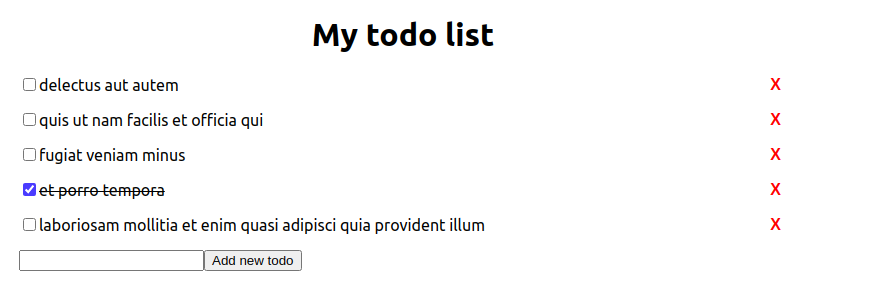
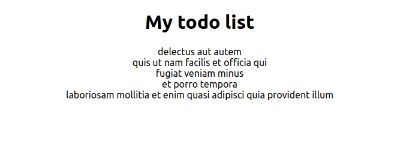
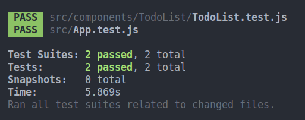
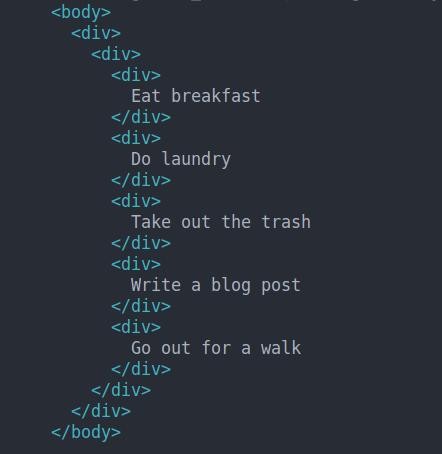
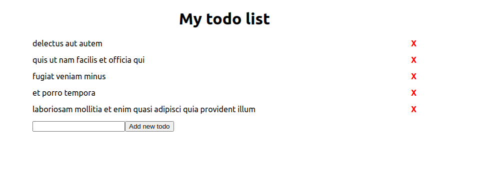

In this tutorial, we're gonna learn how to test React apps with react-testing-library by following a Test Driven Development (TDD) approach.

Testing your app is very important. In the software that you write, you wanna make sure that when you add a feature or refactor code, you don't break anything that has already been working. It could be time consuming to manually test everything again when you add or remove code. It could also be annoying to the user if a feature was working before and after adding a new feature, the previous feature is no longer working. To save us developers of all those troubles, we need to write automated tests.

To demonstrate test driven development with react testing library, we are going to build a Todo app. The user should be able to add, remove, and check off a todo item. This is how are final app will look like.



If you don't want to read but just need the code, here is the [github repo](https://github.com/nainarazz/tdd-todo-demo). Here is also a [codesandbox](https://codesandbox.io/s/tdd-demo-kv7ll?file=/src/setupTests.js) you can test and play around. Note that at the time of this writing, the tests in codesandbox are not working, not because of the code itself but because of the codesandbox environment.

## Prerequisite

To follow this tutorial, I assume you already know React. You know how to use the basic React hooks (useState and useEffect). You also know HTML, CSS, and are familiar with ES6 features and syntax.

## What is TDD

Test Driven Development or TDD is an approach in software development where we first write the tests before writing the actual code. This results in a better code quality, higher test coverage, and better software. There are three steps to do TDD.

1. First, you write a code that fails. This ensures that you avoid false positives. (RED)
2. Next, you write the minimum code to make the test pass. (GREEN)
3. Finally, you refactor to improve the existing implementation. (REFACTOR)

## What is react-testing-library

There are many tools out there to test React apps, with Enzyme being one of the popular options. But in this tutorial, we are going to use [react-testing-library](https://testing-library.com/docs/react-testing-library/intro). React-testing-library is like a wrapper of [DOM Testing Library](https://testing-library.com/docs/dom-testing-library/intro) for testing React components. The DOM Testing Library is a simple, lightweight, open source, library that provides API for querying and interacting with DOM nodes. Besides React, the DOM Testing Library has also been used to create other wrappers for other frameworks, like Angular, Vue, and Svelte.

Why use react-testing-library instead of Enzyme? I really like the philosophy behind the DOM testing library.

> The more your tests resemble the way your software is used, the more confidence they can give you.

This means that our tests should interact with our app just like a real user would do. For example, in our Todo app, a user would have to type in an input, and click the add button to add the item. Our test should also interact with the app in a similar way: type a todo item in the input, and click the button to add the item. Then we verify that the new item has actually been added. With react testing library, this not hard to achieve.

React-testing-library also prevents us from testing implementation details of the app. The implementation details are things that users would normally not see or use. It is only known to the developers (ex. the state of your app). When you are using enzyme, you are more likely to be testing these implementation details. If you test the implementation details, your tests will break if you change/refactor the code. This is something we want to avoid.

If you want to read more about the problems with testing implementation details, here is a nice post written by Kent Dodds [(Testing implementation details)](https://kentcdodds.com/blog/testing-implementation-details).

## Setup

We are going to create a new React app with create-react-app.

```bash
create-react-app demo-tdd
cd demo-tdd
yarn start
```

Then we need to install the libraries we need to test React components.

```bash
npm i --save-dev @testing-library/jest-dom @testing-library/react @testing-library/user-event
```

We installed 3 different libraries.

1. **@testing-library/jest-dom**. We are going to use this to make assertions about the state of the DOM using custom jest matchers for the DOM.
2. **@testing-library/react**. It provides APIs for us to work with React components in our tests.
3. **@testing-library/user-event**. It provides us with API to simulate real events(such as click) in the browser as the user interacts with the DOM. The @testing-library/react library already provides a `fireEvent` function to simulate events, but @testing-library/user-event provides a more advanced simulation.

If you are using the latest version of of Create React App, we also need to install `jest-environment-jsdom-sixteen` otherwise we get a "MutationObserver is not a constructor" error describe in this [github issue](https://github.com/testing-library/dom-testing-library/issues/477).

We are using the latest CRA, so let's install this library.

```bash
npm i --save-dev jest-environment-jsdom-sixteen
```

Inside the `package.json`, change the test script tag to this.

```bash
"scripts": {
   ...
   "test": "react-scripts test --env=jest-environment-jsdom-sixteen",
   ...
}
```

Run the test.

```bash
yarn test
```

## Displaying items in todo list

Let's now get into the real coding. So, as has been said, we are going to build a simple Todo app. The users should be able to see their Todo lists, and be able add and remove a todo item.

### Failing test

Our first task is to create a todo list component that renders the list of todo items. Inside `src/components/TodoList`, we are going to create a TodoList component together with its test file.

```jsx filename=src/components/TodoList/TodoList.js
import React from 'react';

const TodoList = ({ todos }) => <div></div>;

export default TodoList;
```

The TodoList component accepts a list of todos. Because we are first going to write the test before implementing the component, we are simply returning an empty `div` .

```jsx filename=src/components/TodoList/TodoList.test.js linesToHighlight=3,9
import React from 'react';
import '@testing-library/jest-dom';
import { render, screen } from '@testing-library/react';
import TodoList from './TodoList';
import mockData from '../../mockData';

describe('todo list test', () => {
  it('should show title of todos', () => {
    render(<TodoList todos={mockData} />);
    mockData.forEach((d) => expect(screen.getByText(d.title)).toBeInTheDocument());
  });
});
```

Here is our first test. We are testing whether our TodoList component shows us the title of our todo items. The `@testing-library/react` library provides us functions and objects like `render` and `screen` to interact with React components. As you might have already guessed, the `render` function is used to render a React component. We are rendering our TodoList component. Because it needs a list of todos, we pass a fake list of todos.

Here is a what the mockData contains inside src/mockData.js.

```jsx filename=src/mockData.js
const mockData = [
  {
    userId: 1,
    id: 1,
    title: 'Eat breakfast',
    completed: false,
  },
  {
    userId: 1,
    id: 2,
    title: 'Do laundry',
    completed: false,
  },
  {
    userId: 1,
    id: 3,
    title: 'Take out the trash',
    completed: false,
  },
  {
    userId: 1,
    id: 4,
    title: 'Write a blog post',
    completed: true,
  },
  {
    userId: 1,
    id: 5,
    title: 'Go out for a walk',
    completed: false,
  },
];

export default mockData;
```

After rendering the component, we now need to make sure that we are actually seeing our items on the screen. Remember that the more our tests resemble the way our software is used, the more confidence we get? As a user, I expect to see my list of todos on the screen.

We need to query the DOM elements to know what is on the screen. React testing library provides a `screen` object that provides different methods for querying elements in the DOM. We can get elements by their text, role, label, testId, and other ways. You can find all the possible ways of querying DOM elements in the [official docs.](https://testing-library.com/docs/dom-testing-library/api-queries)

So in this piece of code,

```jsx
mockData.forEach((d) => expect(screen.getByText(d.title)).toBeInTheDocument());
```

what we're doing is that we are going through each todo list item and expect the title to be in the document (or page). We are using the `screen.getByText()` to get the element that has the title of our todo. Using Jest's [expect](https://jestjs.io/docs/en/expect) function and [custom matchers](https://github.com/testing-library/jest-dom), we are able to validate that the title indeed exists in the document.

### Making the test pass

If you run yarn test, you should get an error because we haven't implemented our component yet, and we are not seeing any of our todo items.


Okay, so let's implement the TodoList component to make the test pass.

```jsx filename=src/components/TodoList/TodoList.js
import React from 'react';

const TodoList = ({ todos }) => (
  <div>
    {todos.map((t, i) => (
      <div key={i}>{t.title}</div>
    ))}
  </div>
);

export default TodoList;
```

Yes, after making the changes, our test pass.


### Render TodoList component in App component

Let us render the TodoList component in the App component. Instead of using mock data for our list of todos, we are going get the data from a [JSONPlaceholder](http://jsonplaceholder.typicode.com/) - a nice fake REST API that we can play around with.

Let's change our App.js and App.test.js to the following.

```jsx filename=src/App.js
import React, { useState, useEffect } from 'react';
import TodoList from './components/TodoList/TodoList';
import './App.css';

function App() {
  const [todos, setTodos] = useState([]);
  useEffect(() => {
    async function fetchData() {
      const result = await fetch('https://jsonplaceholder.typicode.com/todos').then((response) =>
        response.json()
      );
      setTodos(result.slice(0, 5));
    }
    fetchData();
  }, []);

  return (
    <div className="App">
      <h1 className="header">My todo list</h1>
      {<TodoList todos={todos} />}
    </div>
  );
}

export default App;
```

```jsx filename=src/App.test.js
import React from 'react';
import { render } from '@testing-library/react';
import App from './App';

describe('<App /> tests', () => {
  it('renders <App />', () => {
    render(<App />);
  });
});
```

In `App.js`, we are just basically fetching our list of todos from `"https://jsonplaceholder.typicode.com/todos"` and we set todos state with the result. We are only setting the first 5 result. Then we pass our todos to the `<TodoList />` as prop.

As for the App.test.js, we are just making sure that `<App />` renders. We are going to write more tests in here later.

If we check the browser, we should be able to see something like this.



However, our test in `App.test.js` fails. Hmmm, let's see why.

In the console, we get this.


It says that the json response of our fetch function in `useEffect` is invalid. But why? If we scroll further down the console, we see this.


When we are rendering our `<App />` component in our test, we are making an asynchronous call with fetch API. However, before the response is received, the test finished running and the test environment is torn down. The fetch call is unable to finish properly, and we so we get an error.

So how do we solve this problem? Welcome to mocking.

### Mocking fetch API calls

Mocking is creating a fake implementation of a function, method, or module. Mocking is important because we need fast tests. Making an API call will slow down our tests. Another reason is that calling APIs in a test can give inconsistent results. Sometimes it could fail because of network or server issues which we have no control.

To mock the fetch API, we are going to use [jest-fetch-mock](https://www.npmjs.com/package/jest-fetch-mock). First, let us install the library.

```bash
npm i --save-dev jest-fetch-mock
```

After installing, add the following to `src/setupTests.js` to enable mocks with jest-fetch-mock.

```jsx filename=src/setupTests.js
import fetchMock from 'jest-fetch-mock';

fetchMock.enableMocks();
```

Then in `src/App.test.js`, change the test to this.

```jsx filename=src/App.test.js linesToHighlight=5,6,7
import React from 'react';
import { render } from '@testing-library/react';
import App from './App';

beforeEach(() => {
  fetchMock.once(JSON.stringify(mockData));
});

describe('<App /> tests', () => {
  it('renders <App />', () => {
    render(<App />);
  });
});
```

Now, instead of calling the JSONPlaceholder API, we are just returning our mockData. `fetchMock.once` is a function of jest-fetch-mock that mocks each call of fetch independently. We put it inside `beforeEach` so that we don't have to repeat the same code over and over again.

If you run the test again, the test pass, but with a warning.

> Warning: An update to App inside a test was not wrapped in act(...).
> When testing, code that causes React state updates should be wrapped into act(...):


Basically, this warning tells us that something we didn't expect happened in our component. We made an API call and when the response has returned, we updated our state and our component updated. In our test, we didn't take into consideration that our component will make an update, so React complained.

We need to wrap every interaction we make with the component with `act` to let React know that we are going to make an update. React-testing-library already wraps its APIs with `act`, but sometimes you may still have to fix it manually.

There are several ways to get rid of this error. Kent Dodds has a clear explanation of this error and solutions in his [blog post](https://kentcdodds.com/blog/fix-the-not-wrapped-in-act-warning). You can read further.

The way we are going to solve this problem is we are going to add a loading indicator when we are making API calls. When we are fetching the list of todos, we are going to show "loading" in our page, and when the fetch is successful, we are going to remove it and show the list.

In the `src/App.js`, make the following changes.

```jsx filename=src/App.js linesToHighlight=7,15,23
import React, { useState, useEffect } from 'react';
import TodoList from './components/TodoList/TodoList';
import './App.css';

function App() {
  const [todos, setTodos] = useState([]);
  const [loading, setLoading] = useState(true);

  useEffect(() => {
    async function fetchData() {
      const result = await fetch('https://jsonplaceholder.typicode.com/todos').then((response) =>
        response.json()
      );
      setTodos(result.slice(0, 5));
      setLoading(false);
    }
    fetchData();
  }, []);

  return (
    <div className="App">
      <h1 className="header">My todo list</h1>
      {loading ? 'Loading' : <TodoList todos={todos} />}
    </div>
  );
}

export default App;
```

And in `src/App.test.js`, we also make the following changes.

```jsx filename=src/App.test.js linesToHighlight=6
import { render, screen, waitForElementToBeRemoved } from '@testing-library/react';

// omitted other codes
it('renders <App />', async () => {
  render(<App />);
  await waitForElementToBeRemoved(() => screen.getByText(/loading/i));
});
```

We use the `waitForElementToBeRemoved` from react-testing-library to wait for an element to disappear from the DOM. It returns a promise, so we `await` it.

Now, when you run the test again, all tests pass without warnings.



### Refactoring

Wouldn't it be better if we move the individual todo item to its own component? Let's try to improve the existing implementation of our TodoList component.

```jsx filename=src/components/TodoList/TodoList.js linesToHighlight=2,7
import React from 'react';
import TodoItem from '../TodoItem/TodoItem';

const TodoList = ({ todos }) => (
  <div>
    {todos.map((t, i) => (
      <TodoItem key={i} todo={t} />
    ))}
  </div>
);

export default TodoList;
```

Let's create the `<TodoItem />` component.

```jsx filename=src/components/TodoItem/TodoItem.js
import React from 'react';

const TodoItem = ({ todo }) => <div>{todo.title}</div>;
export default TodoItem;
```

This is the simplest implementation. Our `<TodoItem />` accepts a todo item as prop and renders the title of the todo item. Then we render the component inside the `<TodoList />`.

And our test still passes. This is the best thing about automated tests. Even though we refactor our app, we can still be confident that we don't break anything.

So far we have followed the 3 steps to doing TDD: we created a failing test, implemented code to make test pass, and then refactor. Great!

Before moving on the next feature of our app, I'd like to briefly show a simple function to debug your tests in React testing library.

### Debugging elements

In case you don't know what element to query in the DOM, or maybe your test fail because an element is not found, you can use the `screen.debug()` function to output the DOM elements. It is like the `console.log()` for react testing library.

It can help you write and debug your tests. If we add a `screen.debug()` to our test above, we would get something like this:

```jsx
it('should show title of todos', () => {
  render(<TodoList todos={mockData} />);
  screen.debug();
});
```



## Adding a new todo item

A Todo app is not a Todo app if we cannot add a new todo item, so let us add this capability in our app. Like what we did earlier, we are first going to write a test and then do the implementation.

### Failing test

We are going to put the Add Todo button inside our `<App />` component, so we are going to put the test inside App.test.js.

```jsx filename=src/App.test.js
import React from 'react';
import { render, screen } from '@testing-library/react';
import userEvent from '@testing-library/user-event';
import App from './App';

// omitted beforeEach() ...
describe('<App /> tests', () => {
  // omitted first test...
  it('should add a todo item', async () => {
    fetchMock.once(
      JSON.stringify({
        userId: 3,
        id: Math.floor(Math.random() * 100) + 1,
        title: 'Do math homework',
        completed: false,
      })
    );

    render(<App />);
    await waitForElementToBeRemoved(() => screen.getByText(/loading/i));

    userEvent.type(screen.getByRole('textbox'), 'Do math homework');
    userEvent.click(screen.getByText(/Add new todo/i));
    await waitForElementToBeRemoved(() => screen.getByText(/saving/i));
    expect(screen.getByText(/Do math homework/i)).toBeInTheDocument();
  });
});
```

What's going on in our test?

First, we mock the fetch API calls. In our `beforeEach()` statement, we are already mocking the list of todos. But we also need to mock the POST request we are going to make when creating a new todo. So we call `fetchMock.once` again to mock the return data of the POST request.

Next, we render the App and wait for the "loading" text to disappear (as I have explained in the previous section).

Then we simulate a user typing into our input. We are using to `userEvent.type()` function to do that. It accepts 2 parameters: first is the input element, and second is the value to be typed.

Notice here we are using `screen.getByRole` to get the textbox in our document. It is another method for querying the DOM. For more information, you can always check the [docs](https://testing-library.com/docs/dom-testing-library/api-queries#byrole).

After the user has typed, we now simulate a click by using `userEvent.click()`. We find the element to click using `screen.getByText()`.

_Note:_ w*e are using a regular expression for the text. The "i" means ignore the case.*

After clicking the button, we should see a "saving" text appear. We wait for it to disappear before we finally expect that the value the user typed is in the document (screen).

If you run the test, it should fail.

### Making the test pass

Let's implement the test step-by-step to make it pass.

First, we're going to declare new state for the newTodo item and saving loader.

```jsx filename=src/App.js
// other code above and below
const [newTodo, setNewTodo] = useState('');
const [saving, setSaving] = useState(false);
```

Then we're going to create an event handler for our input. When a user types in the input, we are going to set the newTodo to the value entered by the user. This is later going to be used when saving the data.

```jsx
function onChange(e) {
  const value = e.target.value;
  setNewTodo(value);
}
```

We're also going to implement the add functionality. We are going to post our data to JSONPlaceholder API, and when the response is received, we are going to concat it to our list of todos.

```jsx
function addTodo(e) {
  e.preventDefault();
  const value = {
    userId: 3,
    id: Math.floor(Math.random() * 10000) + 1,
    title: newTodo,
    completed: false,
  };

  setSaving(true);
  fetch('https://jsonplaceholder.typicode.com/todos', {
    method: 'POST',
    body: JSON.stringify(value),
    headers: {
      'Content-type': 'application/json; charset=UTF-8',
    },
  })
    .then((response) => response.json())
    .then((result) => {
      setTodos(todos.concat({ ...result, id: value.id }));
      setSaving(false);
    });
}
```

Notice here that the title of the new item is the todo state that we saved earlier. We are also setting the saving indicator to true before fetching and setting it to false after receiving the results.

Finally, we attach those handlers to the input and button. If it is saving, we display the "saving" indicator. Otherwise, we show the input and button.

```jsx
<div className="add-todo-form">
  {saving ? (
    'Saving'
  ) : (
    <form onSubmit={addTodo}>
      <input type="text" onChange={onChange} />
      <button type="submit">Add new todo</button>
    </form>
  )}
</div>
```

If you run the test, it should all pass. The app should also work properly in the browser.

Here is our new App.js file.

```jsx filename=src/App.js
import React, { useState, useEffect } from 'react';
import TodoList from './components/TodoList/TodoList';
import './App.css';

function App() {
  const [todos, setTodos] = useState([]);
  const [loading, setLoading] = useState(true);
  const [newTodo, setNewTodo] = useState('');
  const [saving, setSaving] = useState(false);

  function onChange(e) {
    const value = e.target.value;
    setNewTodo(value);
  }

  function addTodo(e) {
    e.preventDefault();
    const value = {
      userId: 3,
      id: Math.floor(Math.random() * 10000) + 1,
      title: newTodo,
      completed: false,
    };

    setSaving(true);
    fetch('https://jsonplaceholder.typicode.com/todos', {
      method: 'POST',
      body: JSON.stringify(value),
      headers: {
        'Content-type': 'application/json; charset=UTF-8',
      },
    })
      .then((response) => response.json())
      .then((result) => {
        setTodos(todos.concat({ ...result, id: value.id }));
        setSaving(false);
      });
  }

  useEffect(() => {
    async function fetchData() {
      const result = await fetch('https://jsonplaceholder.typicode.com/todos').then((response) =>
        response.json()
      );
      setTodos(result.slice(0, 5));
      setLoading(false);
    }
    fetchData();
  }, []);

  return (
    <div className="App">
      <h1 className="header">My todo list</h1>
      {loading ? 'Loading' : <TodoList todos={todos} />}

      <div className="add-todo-form">
        {saving ? (
          'Saving'
        ) : (
          <form onSubmit={addTodo}>
            <input type="text" onChange={onChange} />
            <button type="submit">Add new todo</button>
          </form>
        )}
      </div>
    </div>
  );
}

export default App;
```

## Removing a todo item

To implement this functionality, we must first go back to our TodoItem component and add the remove buttons for each todo item. When the user clicks the button, it is going to remove the clicked item.

### Failing test for close button

We're going to write a test that the button is actually on the screen. Let's create a new test file inside src/components/TodoItem.

```jsx filename=src/components/TodoItem/TodoItem.test.js linesToHighlight=11
import React from 'react';
import '@testing-library/jest-dom';
import { render, screen } from '@testing-library/react';
import TodoItem from './TodoItem';
import mockData from '../../mockData';

describe('<TodoItem /> tests', () => {
  it('should render todo item properly', () => {
    render(<TodoItem todo={mockData[0]} />);
    expect(screen.queryByText(/eat breakfast/i)).toBeInTheDocument();
    expect(screen.getByTestId('close-btn-1')).toBeInTheDocument();
  });
});
```

There's nothing new here except for the [screen.getByTestId](https://testing-library.com/docs/dom-testing-library/api-queries#bytestid). We are rendering a todoItem, passing the first item in our mockData as prop, and then expecting that the title of the item ('eat breakfast') and the close button to be on the screen.

We use the `getByTestId` query to get the close button. The way `getByTestId` query works is that we assign an element with `data-testid` attribute and we can query that element through the value of the attribute.

We use the getByTestId when we cannot query something with what is visible on the screen, like the text, role, or label. As the [docs](https://testing-library.com/docs/dom-testing-library/api-queries#bytestid) says, we should only use this if the other DOM queries don't work for our case.

### Making the test pass for close button

Let us change our HTML markup in `<TodoItem />` to this. Let us also added css file for some styling.

```jsx filename=src/components/TodoItem/TodoItem.js linesToHighlight=4,9
import React from 'react';
import styles from './TodoItem.module.css';

const TodoItem = ({ todo, removeHandler }) => (
  <div className={styles.itemContainer}>
    <div>{todo.title}</div>
    <button
      className={styles.closeBtn}
      data-testid={`close-btn-${todo.id}`}
      onClick={() => removeHandler(todo.id)}
    >
      X
    </button>
  </div>
);

export default TodoItem;
```

```css filename=src/components/TotoItem.module.css
.itemContainer {
  display: flex;
  justify-content: space-between;
  margin: 15px 0;
}

.closeBtn {
  color: red;
  font-weight: 800;
}

.closeBtn:hover {
  cursor: pointer;
}
```

Here we have passed a `removeHandler` as prop to handle the click event. We are going to pass the id of the todo item so that we may know which item to delete. Notice we also have the `data-testid` attribute. This is going to be used by our test to query the span element.

Right now if you check the browser, the CSS is not properly centered. Let's change App.css to do this.

```css filename=App.css
.App {
  width: 40%;
  margin: auto;
}

.header {
  text-align: center;
}
```

And now we have this.



### Implementing the remove handler

At the moment if you click at the remove button, it's going to throw an error because we haven't implemented it yet. Let's go and implement it. Inside `App.test.js`, add the following test case.

```jsx filename=App.test.js
it('remove todo from list', async () => {
  render(<App />);
  await waitForElementToBeRemoved(() => screen.getByText(/loading/i));
  userEvent.click(screen.getByTestId('close-btn-3'));
  expect(screen.queryByText(/Take out the trash/i)).not.toBeInTheDocument();
});
```

Again, nothing new in here. We render the app as usual, wait for the loading indicator to disappear, then click the 3rd remove button (we get the element through getByTestId), and then assert that the item is NOT in the document.

Inside `App.js`, let us add add a `removeTodo()` function and pass it down to our `<TodoList />`, then to `<TodoItem />` .Our `removeTodo` is just going to filter our todos and set a new state.

```jsx filename=App.js linesToHighlight=9
// ...other codes
function removeTodo(id) {
  setTodos(todos.filter((t) => t.id !== id));
}

return (
  <div className="App">
    <h1 className="header">My todo list</h1>
    {loading ? 'Loading' : <TodoList todos={todos} removeHandler={removeTodo} />}

    <div className="add-todo-form">
      {saving ? (
        'Saving'
      ) : (
        <form onSubmit={addTodo}>
          <input type="text" onChange={onChange} />
          <button type="submit">Add new todo</button>
        </form>
      )}
    </div>
  </div>
);
```

```jsx filename=src/components/TodoList/TodoList.js linesToHighlight=1,4
const TodoList = ({ todos, removeHandler }) => (
  <div>
    {todos.map((t, i) => (
      <TodoItem key={i} todo={t} removeHandler={removeHandler} />
    ))}
  </div>
);
```

And now the remove functionality should work. The tests should also pass. Great!

## Completing a todo item

The last thing I'd like us to implement is to allow the user to checkoff a todo item when he/she has completed a task.

In our `TodoItem.test.js` file, let us add the following test case.

```jsx filename=TodoItem.test.js
// ...other test case above
it('should render todo item with checkbox.', () => {
  render(<TodoItem todo={mockData[0]} />);
  expect(screen.getByTestId('checkbox-1')).toBeInTheDocument();
  expect(screen.queryByText(/eat breakfast/i)).toBeInTheDocument();
});
```

You would probably already know by now what this does 😀 We are simply checking that the checkbox is on the screen.

In our TodoItem component, we are going to add a checkbox before each item. Change the HTML markup to this.

```jsx filename=src/components/TodoItem/TodoItem.js
const TodoItem = ({ todo, removeHandler, updateTodo }) => (
  <div className={styles.itemContainer}>
    <div>
      <input
        type="checkbox"
        name={`checkbox-${todo.id}`}
        checked={todo.completed}
        data-testid={`checkbox-${todo.id}`}
        onChange={() => updateTodo(todo.id)}
      />
      <label
        htmlFor={`checkbox-${todo.id}`}
        onClick={() => updateTodo(todo.id)}
        className={todo.completed ? styles.completed : ''}
      >
        {todo.title}
      </label>
    </div>
    <button
      className={styles.closeBtn}
      data-testid={`close-btn-${todo.id}`}
      onClick={() => removeHandler(todo.id)}
    >
      X
    </button>
  </div>
);
```

We have changed the markup by adding a checkbox input and label containing the title of the todo item. The `todo` prop object has a property called completed. When it is true, we set the value of our checkbox to checked, and we add a **_completed_** class to the label (which we're gonna use for testing below). We also passed `updateTodo` handler to change the state of our checkbox.

In TodoItem.module.css, let's add the style for a completed item.

```css filename=src/components/TodoItem/TodoItem.module.css
// ..other styles above
.completed {
  text-decoration: line-through;
}
```

Great. We're really almost done 😀. Now that we have added the checkbox and markup set up, we are going to implement updateTodo handler.

As usual, we are first going to add a test first. What are we going to expect if a user checks-off a todo item? As a user, I should see that the item is crossed out on the screen. I guess there's really no best way to do this than to check the css. It looks like we are testing an implementation detail, but the computer cannot see like us human that the item is actually crossed out 😅 So I guess checking if the css is applied will just be fine.

```jsx filename=src/components/TodoItem/TodoItem.test.js linesToHighlight=6
// other tests above
it('todo item should be crossed out after completing', async () => {
  render(<App />);
  await waitForElementToBeRemoved(() => screen.getByText(/loading/i));
  userEvent.click(screen.getByTestId('checkbox-1'));
  expect(screen.getByText(/eat breakfast/i)).toHaveClass('completed');
});
```

We use the `toHaveClass` matcher of Jest to know that the class has been applied to an element.

To make the test pass, inside App.js, we are going to add the updateTodo function and pass it to our TodoItem component.

```jsx filename=App.js linesToHighlight=19
// other code above
function updateTodo(id) {
  const newList = todos.map((todoItem) => {
    if (todoItem.id === id) {
      const updatedItem = { ...todoItem, completed: !todoItem.completed };
      return updatedItem;
    }
    return todoItem;
  });
  setTodos(newList);
}

return (
  <div className="App">
    <h1 className="header">My todo list</h1>
    {loading ? (
      'Loading'
    ) : (
      <TodoList todos={todos} removeHandler={removeTodo} updateTodo={updateTodo} />
    )}

    <div className="add-todo-form">
      {saving ? (
        'Saving'
      ) : (
        <form onSubmit={addTodo}>
          <input type="text" onChange={onChange} />
          <button type="submit">Add new todo</button>
        </form>
      )}
    </div>
  </div>
);
```

```jsx filename=src/components/TodoList/TodoList.js linesToHighlight=4
const TodoList = ({ todos, removeHandler, updateTodo }) => (
  <div>
    {todos.map((t, i) => (
      <TodoItem key={i} todo={t} removeHandler={removeHandler} updateTodo={updateTodo} />
    ))}
  </div>
);
```

And yes, our test pass.


Congrats 🎉! Our TodoList is finally complete. And it is fully tested. We have a total of 3 test suites and 7 tests cases in all. We can have confidence that if we refactor of change something, our app won't break.

## Summary

This tutorial has been really long 😅. If you have followed up to this point, I wanna congratulate you.

We have built a complete Todo app. Along the way, we have learned how to write tests first before writing the implementation. We learned how to use react-testing-library to test our components based on how the user is going to user our app and not the implementation details. You can learn more about what the library can do in its [official documentation](https://testing-library.com/docs/intro). There are still many queries that we haven't used in this tutorial.

If you wanna play around with the code, I have created a [github repo](https://github.com/nainarazz/tdd-todo-demo) and a [codesandbox](https://codesandbox.io/s/tdd-demo-kv7ll?file=/src/setupTests.js). Check them out. At the time of this writing, the tests in codesandbox are not working. It is a problem with the codesandbox environment and not the code itself.
