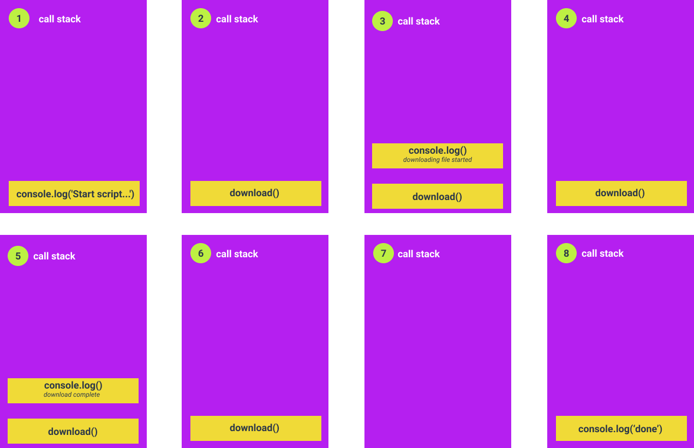
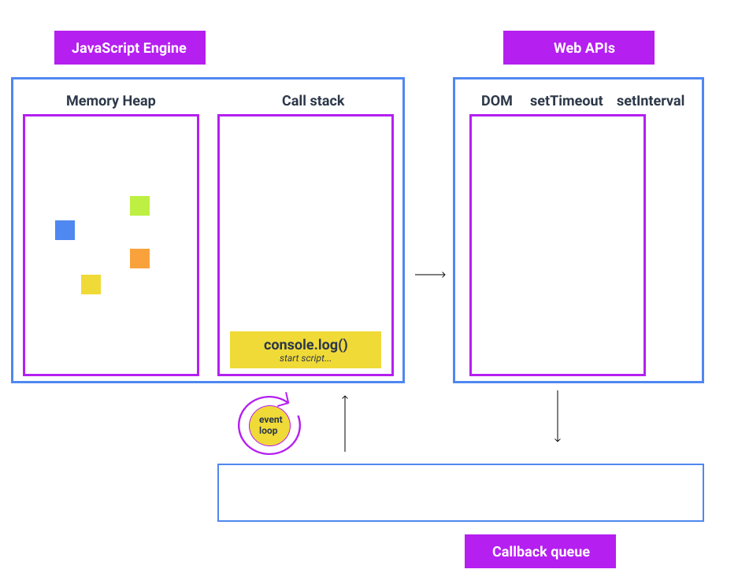
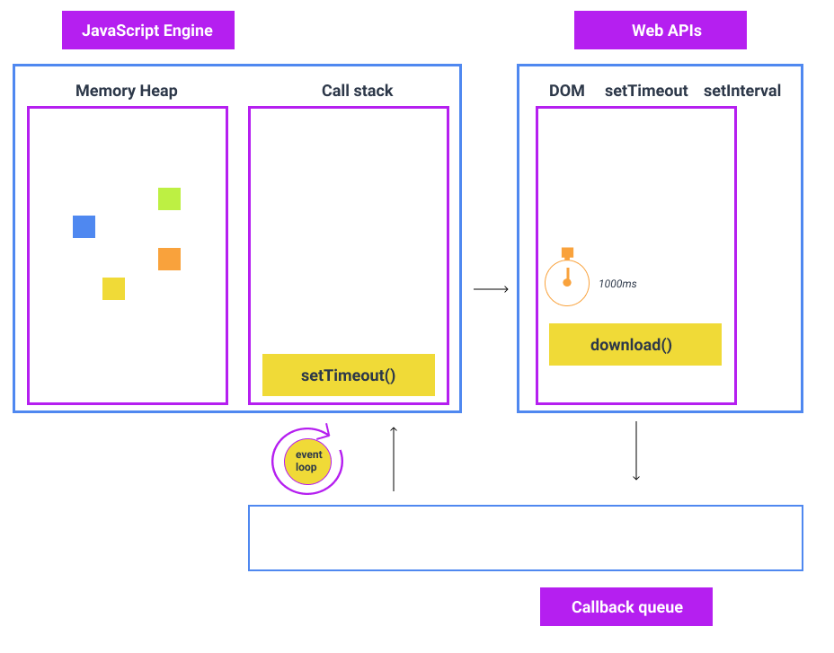
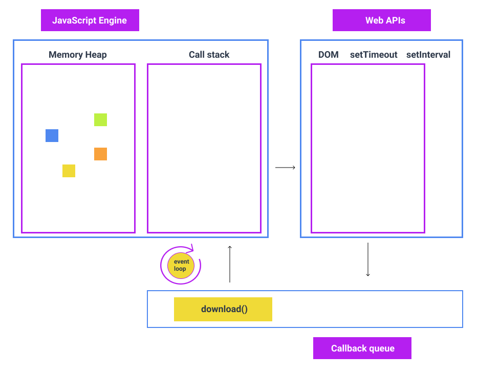
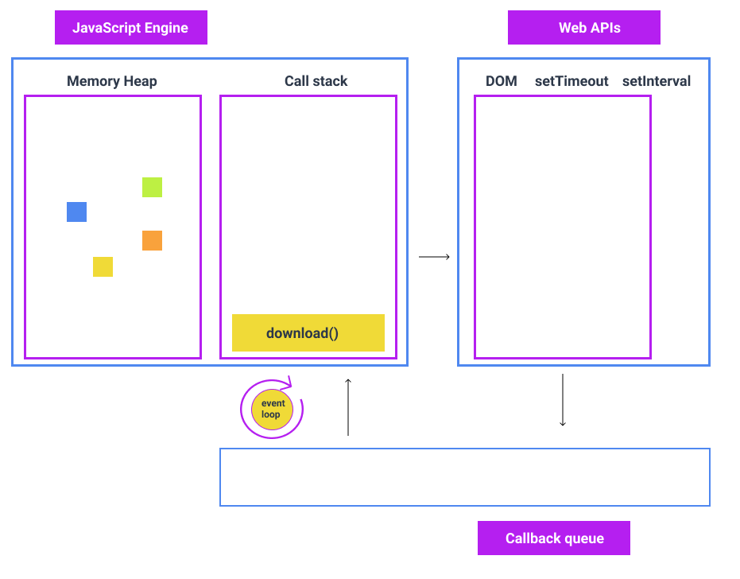

Have you heard of the event loop in JavaScript? Do you know how it works? If you want to become a better JavaScript developer, you need to know how JavaScript works behind the scenes.

In this post I want to give you a visual explanation and understanding of how JavaScript executes your functions, and how the event loop works.

## Single-threaded model of JavaScript

JavaScript is a **single-threaded** and **synchronous** programming language. What is that mean?

When we say single-threaded, it simply means that JavaScript can only perform one operation at a time. It goes through the lines of code one by one. Until the previous code has finished execution, it will not proceed to execute the next code (_synchronous execution_).

But there is a problem with this model. If there is a long operation that is taking place, it could block the whole thread because the next operation has to wait until the long operation is done. This would make the web page unresponsive.

Take for example the following code.

```javascript
function download(message) {
  console.log(message);
  // emulate time consuming task
  for (let i = 0; i < 10000000000; i++) {}
  console.log('download complete');
}

console.log('Start script...');
download('downloading file started');
console.log('Done!');
```

If you run this code in your browser console, you will see the following output.

```console
Start script...
downloading file started
download complete
Done!
```

Depending on how fast your computer is, you will notice that the second message stays there for some period of time. This is because the thread is being blocked by the long executing task, and it cannot proceed to execute the next function until the previous function is finished.

How does JavaScript execute our code above?

### Call stack

The JavaScript engine has a call stack. The call stack keeps track of the function that is currently being called and the functions called inside a function. The JavaScript engine uses the call stack to know which function to execute next.

It works in a Last-In-First-Out fashion (LIFO). The last function that is added into the call stack is the first one that is run.

Think of the stack as a pile of books. The last book that you have added on to the pile is the first book that you will pick out of the pile.

Let us see what is happening in the call stack from the example above.

1. The first function added into the stack is the `console.log('Start script ...')`.
2. When it finishes, it gets popped out of the stack and the next function, `download()`, is pushed into the stack.
3. Inside `download`, we have another `console.log`, so it gets pushed into the stack and it executes. After it finishes, it gets popped out.
4. Then the `for loop` is executed.
5. Then we see the last `console.log` inside `download()` pushed into the stack.
6. After executing, it is popped out of the stack.
7. Because `donwload` has finished executing, it is also popped out of the stack.
8. Finally the last `console.log` is added on the stack and executed.



## Asynchronous JavaScript

To prevent blocking the thread for long operations, the web API provides us with functions that allow us to run code asynchronously. As opposed to synchronous functions, asynchronous functions don't wait for one function to finish before executing the next function.

You can write asynchronous functions using asynchronous callbacks. Async callbacks are just functions that are passed as arguments to another function, but will be called at a later time. An async callback function basically tells the browser, "Hey do this thing, but don't wait for me to finish. I'll call you back when I am done".

When you wrap long executing functions inside an asynchronous callback, they become non-blocking functions because the browser will be able to do other things instead of waiting for the function to finish.

A real life analogy is when you cook food. You can do other activities while the food is being cooked. You just have to keep checking on it if it is done or not.

Let us convert our example above to be asynchronous.

```javascript linesToHighlight=9
function download(message) {
  console.log(message);
  // emulate time consuming task
  for (let i = 0; i < 10000000000; i++) {}
  console.log('download complete');
}

console.log('Start script...');
setTimeout(() => download('downloading file...'), 1000);
console.log('Done!');
```

Again, if you run the code, you will see the following output.

```console
	Start script...
	Done!
	downloading file...
	download complete
```

Notice that this time the last `console.log(Done!)` comes before the console logs inside the download function.

Why is that?

The JavaScript engine didn't wait for the `download()` to finish before executing the next statement because we wrapped `download()` inside an asynchronous callback function.

The `setTimeout()` function is part of the API of the browser (_web API_), and it executes the callback function after _x_ milliseconds as specified. The web API contains other functions that allow us execute functions asynchronously. For example, functions that allow us to interact with the DOM, setInterval, and HttpRequests functions.

**It is important to note that callback functions can either be synchronous or asynchronous.** A callback function is asynchronous when we wrap it with the functions provided by the web API, such as in the example above. It will be executed at a later time.

Here is an example that uses synchronous callback.

```javascript
const books = [
  { title: 'fiction', author: 'Arthur' },
  { title: 'stories', author: 'Connor' },
  { title: 'non fiction', author: 'James' },
];

console.log('first');
const titles = books.map((b) => {
  console.log('book', b.title);
  return b.title;
});

console.log('end');
```

When you run the code, you will see that the code is executed in order.

```console
	first
	fiction
	stories
	non fiction
	end
```

## Event loop

How does JavaScript execute asynchronous functions behind the scenes?

Let us look at this example again.

```javascript
function download(message) {
  console.log(message);
  // emulate time consuming task
  for (let i = 0; i < 10000000000; i++) {}
  console.log('download complete');
}

console.log('Start script...');
setTimeout(() => download('downloading file...'), 1000);
console.log('Done!');
```

Here, the first `console.log(start script...)` is pushed into the call stack, executed, then popped out of the stack. We already know that.



Then the `setTimeout()` is pushed into the call stack. Something interesting happens at this stage. After it is placed into the stack, the web API starts a timer that will expire after 1000
milliseconds (_that is what we specified in the setTimeout function_).



Because `setTimeout()` has executed, it is removed from the call stack and the next function, `console.log('Done!)`, is pushed into the stack and executed.

Notice that the long operation `download()` which is wrapped by the the `setTimeout()` function has not run yet. That is why you see `console.log('Done!')` before the console logs inside `download()`. The `setTimeout()` just starts a 1000ms timer.


After 1000ms has expired, the `download()` function is put into the callback queue. The **callback queue** contains the functions that will soon be executed.



Now here is where the event loop comes in. The **event loop** is a continuous running process that constantly checks if the call stack is empty or not. If the call stack is empty, it will move the function from the callback queue into the call stack and it gets executed.

In our example, after the `console.log('Done!')` has executed, the call stack becomes empty. The event loop checks the call back queue to see if there is anything to execute. It sees the`download`, so it pushes it to the call stack to be executed.



It's that simple.

Once the `download()` is on the call stack, it will execute the function. At this point you already know how the call stack is going to look like.

## Conclusion

JavaScript uses a single-threaded, synchronous model. As we have seen, this poses a challenge when a long process blocks the thread. Through the help the web API and event loop, we are able to call functions asynchronously without blocking the thread.

If you are executing JavaScript in the server, Node.js also provides an API that allows you to call functions asynchronously.

I hope this post has given you a better undestanding of how JavaScript works.

## Video resource

[What the heck is the event loop anyway](https://www.youtube.com/watch?v=8aGhZQkoFbQ)
